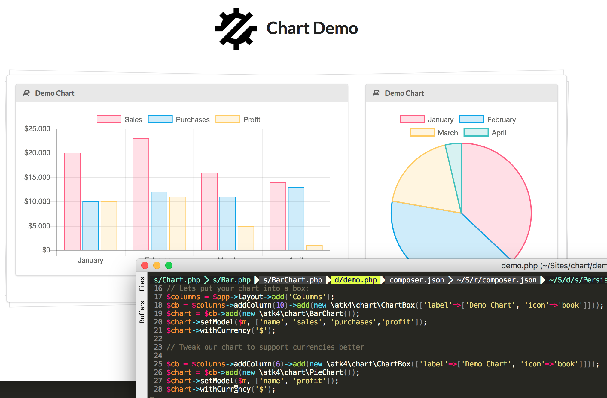

# Agile Charts - Integration for ChartJS into Agile Toolkit

ChartJS is an open-source JavaScript library. This add-on
offers a deep integration betwene Agile UI, Agile Data and
chartJS.



## Documentation

https://github.com/atk4/report/blob/develop/docs/index.md

## Real Usage Example

https://github.com/atk4/report/blob/develop/docs/full-example.md

## Installation

Add the following inside your `composer.json` file:

``` json
{
    "require": {
        "atk4/report": "dev-develop"
    },
    "repositories": [
      {
          "type": "package",
          "package": {
              "name": "atk4/report",
              "version": "dev-develop",
              "type": "package",
              "source": {
                  "url": "git@github.com:atk4/report.git",
                  "type": "git",
                  "reference": "develop"
              }
          }
      }
    ],
}
```


``` console
composer install
```

## Current Status

Report extension is currently under development.
